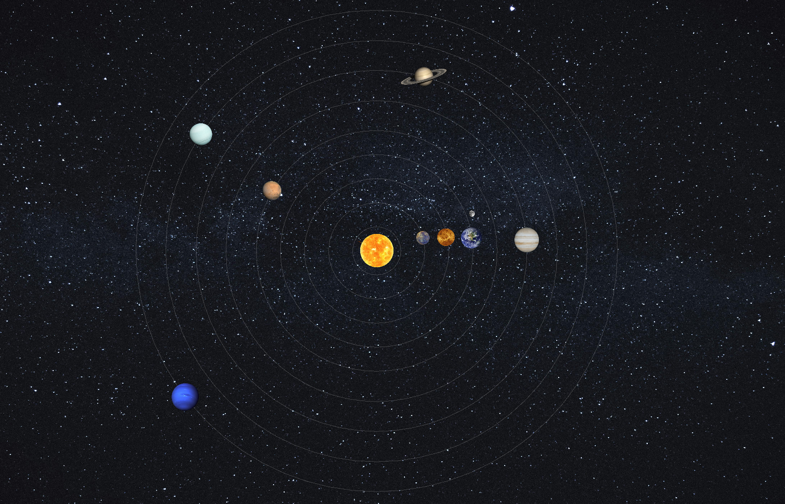

# Solar System Simulator (Java)

A Java-based Solar System simulator built with Swing and AWT. It displays the Sun and all major planets with simple orbital animation and provides short descriptive information about each planet.

## Description

The simulator renders a minimal, simplified Solar System. Each planet has a defined size, color, and orbit radius. A timer updates orbital angles to animate motion around the Sun. Descriptions for all eight major planets are included, covering basic characteristics and notable features.

## Features

- Rendering of the Sun and eight major planets
- Simple orbital animation
- Scaled sizes and distances (approximate, not realistic)
- Separate text descriptions for each planet
- Uses only core Java (Swing and AWT)
- No external dependencies

## Requirements

- Java Development Kit (JDK) 18 or newer
- Any operating system that supports Java

## Installation

1. Clone or download the project directory:
   git clone https://github.com/yourusername/SolarSystemSimulator.git

2. Enter the project folder:
   cd SolarSystemSimulator

3. Compile the source files:
   javac *.java

4. Run the simulator:
   java SolarSystemPanel
   (Replace SolarSystemPanel with your main class if different.)

## Planet Information

Each description includes:
- Order in the solar system
- General physical traits
- Orbit duration and distance
- Notable features

Planets included:
Mercury, Venus, Earth, Mars, Jupiter, Saturn, Uranus, Neptune.

## How It Works

- A Swing JPanel handles drawing.
- A timer updates angles to move planets along orbital paths.
- Each planet has predefined properties: color, size, orbit radius, and speed.
- The panel repaints regularly to animate movement.
- Descriptions are stored separately in a single class.

## Possible Improvements

- Add moons or additional celestial bodies
- Add zoom controls and camera movement
- Add clickable UI to view planet descriptions
- Switch from Swing to JavaFX or OpenGL
- Improve scaling or implement physics-based orbital movement
